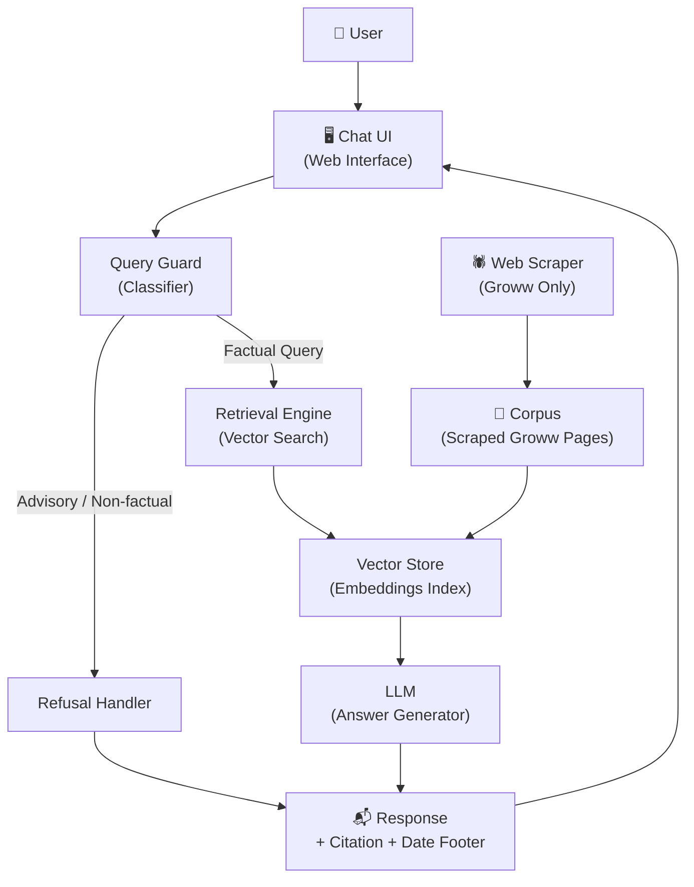
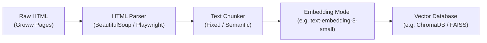
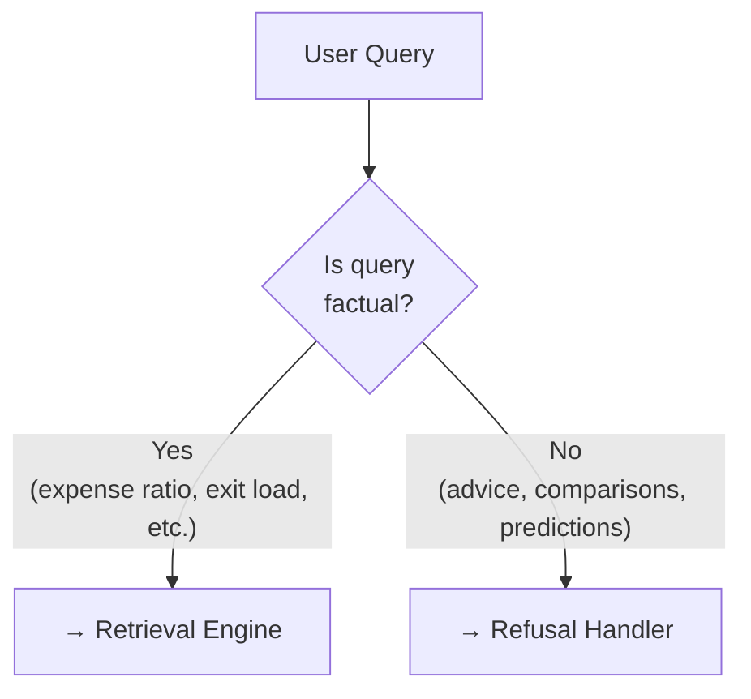
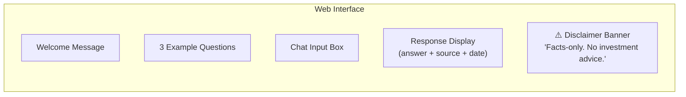
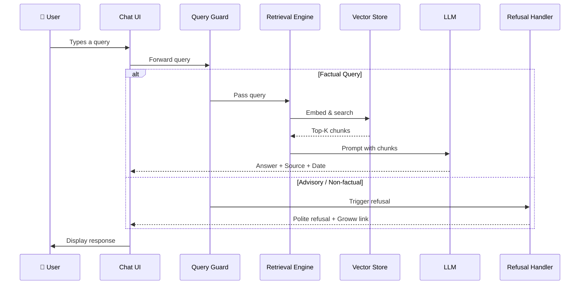

# Architecture: Mutual Fund FAQ Assistant (RAG-Based)

> ⚠️ **"Facts-only. No investment advice."**

---

## 1. High-Level Architecture Overview

The system follows a **Retrieval-Augmented Generation (RAG)** pattern. Instead of relying on a language model's parametric memory, every answer is grounded in content retrieved from a curated, source-controlled corpus scraped exclusively from [groww.in](https://groww.in).



---

## 2. Component Breakdown

### 2.1 Web Scraper

| Property | Detail |
|----------|--------|
| **Purpose** | Fetch and parse content from Groww mutual fund pages |
| **Scope** | 7 PPFAS scheme URLs only (see corpus below) |
| **Allowed Sources** | `groww.in` exclusively — no third-party sites |
| **Output** | Cleaned text chunks with associated source URL and scrape timestamp |
| **Trigger** | Scheduled refresh (e.g., nightly) or on-demand |

**Scraped fields per scheme:**
- Expense ratio
- Exit load
- Minimum SIP / lump sum amount
- Riskometer classification
- Benchmark index
- ELSS lock-in period (where applicable)
- Download links for statements / capital gains reports

---

### 2.2 Corpus & Vector Store



| Property | Detail |
|----------|--------|
| **Chunking strategy** | Semantic chunking by section (e.g., one chunk per fund fact) |
| **Embedding model** | OpenAI `text-embedding-3-small` or equivalent open-source model |
| **Vector DB** | ChromaDB (local) or FAISS for lightweight deployment |
| **Metadata stored** | `source_url`, `scheme_name`, `last_scraped_at`, `section_title` |

---

### 2.3 Query Guard (Classifier)

The Query Guard is a **pre-LLM filter** that classifies incoming user queries before any retrieval is attempted.



**Refusal triggers include:**
- Queries asking *"should I invest…"*, *"which is better…"*, *"will returns go up…"*
- Requests for performance comparisons or return projections
- Any query involving PII (PAN, Aadhaar, account number, OTP)

---

### 2.4 Retrieval Engine

| Step | Detail |
|------|--------|
| **Query embedding** | Embed user query using the same model as the corpus |
| **Similarity search** | Top-K nearest chunks retrieved from the vector store |
| **Re-ranking** | Optional: re-rank by recency of `last_scraped_at` |
| **Context assembly** | Top chunks assembled into LLM prompt context |

---

### 2.5 LLM Answer Generator

The LLM receives a **strictly constrained prompt**:

```
System Prompt:
  You are a facts-only mutual fund FAQ assistant.
  - Answer using ONLY the provided context.
  - Limit your answer to 3 sentences maximum.
  - Do NOT provide investment advice, opinions, or comparisons.
  - End every response with:
      Source: <source_url>
      Last updated from sources: <last_scraped_at>
  - If the context does not contain the answer, say so and link to the Groww page.

Context: <retrieved_chunks>
User Question: <user_query>
```

| Property | Detail |
|----------|--------|
| **Max response length** | 3 sentences |
| **Citation** | Exactly 1 source URL per response |
| **Footer** | `Last updated from sources: <date>` |
| **Hallucination guard** | Responses grounded only in retrieved context |

---

### 2.6 Refusal Handler

Returns a templated polite refusal for non-factual queries.

**Example refusal response:**
> *"This assistant only answers factual questions about mutual fund schemes — such as expense ratios, exit loads, or SIP minimums. For investment guidance, please consult a SEBI-registered advisor. You can explore fund details at [groww.in/mutual-funds](https://groww.in/mutual-funds)."*

---

### 2.7 User Interface (Chat UI)



| Element | Description |
|---------|-------------|
| **Welcome message** | Brief intro explaining the assistant's scope |
| **Example questions** | Pre-filled clickable prompts (e.g., "What is the expense ratio of Parag Parikh Flexi Cap Fund?") |
| **Disclaimer** | Persistent banner: *"Facts-only. No investment advice."* |
| **Response card** | Answer text + citation link + last updated footer |

---

## 3. Data Flow (End-to-End)



---

## 4. Corpus: PPFAS Scheme URLs

| # | Scheme | Source URL |
|---|--------|------------|
| 1 | Long Term Value Fund | [groww.in](https://groww.in/mutual-funds/parag-parikh-long-term-value-fund-direct-growth) |
| 2 | ELSS Tax Saver Fund | [groww.in](https://groww.in/mutual-funds/parag-parikh-elss-tax-saver-fund-direct-growth) |
| 3 | Large Cap Fund | [groww.in](https://groww.in/mutual-funds/parag-parikh-large-cap-fund-direct-growth) |
| 4 | Conservative Hybrid Fund | [groww.in](https://groww.in/mutual-funds/parag-parikh-conservative-hybrid-fund-direct-growth) |
| 5 | Liquid Fund | [groww.in](https://groww.in/mutual-funds/parag-parikh-liquid-fund-direct-growth) |
| 6 | Arbitrage Fund | [groww.in](https://groww.in/mutual-funds/parag-parikh-arbitrage-fund-direct-growth) |
| 7 | Dynamic Asset Allocation Fund | [groww.in](https://groww.in/mutual-funds/parag-parikh-dynamic-asset-allocation-fund-direct-growth) |

---

## 5. Privacy & Security Architecture

| Concern | Mitigation |
|---------|-----------|
| No PII collection | UI has no login, no form fields for personal data |
| No session storage | Queries are stateless; no conversation history stored |
| No PAN / Aadhaar handling | Query Guard rejects any query pattern matching PII |
| Source integrity | Only `groww.in` domain whitelisted in scraper |

---

## 6. Technology Stack (Recommended)

| Layer | Technology |
|-------|-----------|
| **Scraper** | Python + Playwright or BeautifulSoup |
| **Embedding** | OpenAI `text-embedding-3-small` / `sentence-transformers` |
| **Vector Store** | ChromaDB (local) or FAISS |
| **LLM** | OpenAI GPT-4o-mini or Google Gemini Flash |
| **Backend** | Python + FastAPI |
| **Frontend** | HTML + Vanilla CSS + JavaScript |
| **Scheduler** | cron job / GitHub Actions for corpus refresh |

---

## 7. Known Limitations

> [!WARNING]
> The following limitations should be communicated clearly to users.

- **Corpus freshness**: Data accuracy depends on the last scrape date; stale data may lead to outdated answers.
- **Scraping fragility**: Any Groww website structure change may break the scraper and require maintenance.
- **Scope boundary**: Only PPFAS schemes are covered; queries about other AMCs will be refused or go unanswered.
- **No real-time NAV**: Live NAV data is not retrieved; users are redirected to the Groww URL for current prices.
- **Language**: English only; no multilingual support in initial scope.
- **No authentication**: The assistant is stateless and does not personalise responses.
